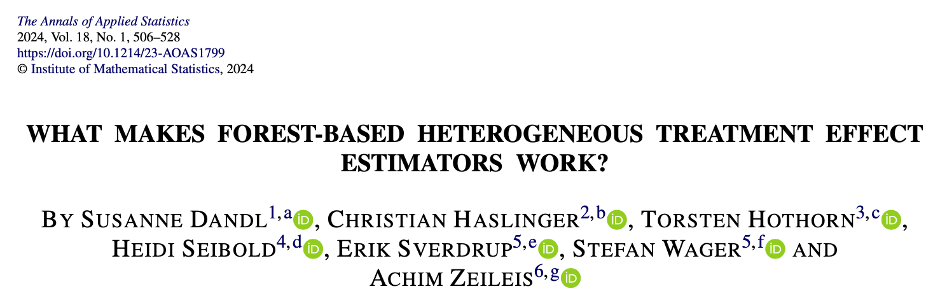

# Forest based HTE estimators

Here we (attempt to) replicate and extend the findings in the [seminal paper](https://doi.org/10.1214/23-AOAS1799) by Dandl et.al.

# How to use this REPO?

## 1. Use-Case: Run a new simulation
To run a new simulation e.g. for a new DoubleML algorithm there are two steps.
1. Change the parameters in the `def.R` file. They are all self-explanatory. 
2. Run the `run_study.R` file.

## 2. Use-Case: Plot Simulation Results
To plot the simulation results run the `create_plots_tables.R` file. The study names correspond to the `.rds` files in the `results` folder, which contain the simulation results. 

Note that if you want to try a new DoubleML algorithm, just simulate the DoubleML algorithm (`methods = c("doubleml")`)

# Overview over the files

### run_study.R
This is the high-level functions which brings all the Rscripts together and runs the simulation.

### create_plots_tables.R
Creates the plots and tables of the simulation results (also the plot of interest)

### def.R
Defines global parameters, mainly three things:
- which methods (aka algorithms like double) should be used in the simulations
- under which filepath the "results" of the simulation should be saved
- global parameters like (1) number of trees (2) number of cores (3) number of repetitions for each study setting

### DGP.R
creates the data-generating-process setups described in the paper

### helpers.R
defines helper functions

### run.R
defines the run-functions for the algorithms. Here the double-ML function is defined

### setup.R
imports the packages

# How to change the DoubleML-algorithm

Add new DoublML-algo by defining new wrapper-functions for each new specification. To the methods list. Call the function `fun.{algo_name}` and add "algo_name" to the `methods` list.

